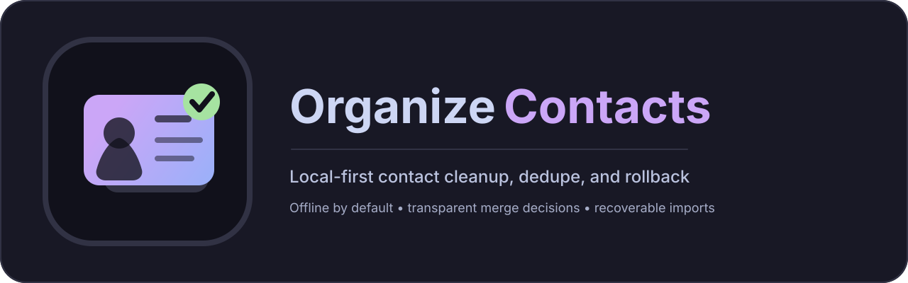

# OrganizeContacts



[](https://github.com/SysAdminDoc/OrganizeContacts/releases)
[](LICENSE)
[](https://github.com/SysAdminDoc/OrganizeContacts)
[](https://dotnet.microsoft.com/)

OrganizeContacts is a Windows desktop app for importing, reviewing, cleaning, deduplicating, and exporting contact files.

## Supported Workflows

- Import a folder of supported contact files or choose individual files.
- Preview imports before committing changes.
- Import vCard 2.1/3.0/4.0, Google CSV, Outlook CSV, LDIF, jCard, and
  read-only CardDAV address books.
- Import copied Android `contacts2.db` SQLite databases, including groups and
  bounded embedded photos.
- Review duplicate groups with match reasons and confidence.
- Run cleanup for phone, email, URL, category, photo, and regex-based field cleanup.
- Export contacts to vCard 3.0/4.0, Google CSV, Outlook CSV, jCard, or
  birthday/anniversary iCalendar.
- Restore prior import snapshots and undo merge operations.
- Switch between dark, light, and Windows high-contrast themes.

## Current App Status

- Native WPF / .NET 10 desktop shell.
- SQLite storage with import history, audit entries, rollback snapshots, and merge undo.
- MVVM pattern with `CommunityToolkit.Mvvm`.
- Progress reporting for long-running import, cleanup, export, duplicate scan, merge, reload, and clear operations.
- Lossless modeled-field round trips for generated vCard, jCard, Google CSV,
  and Outlook CSV exports, with field-level verification in the CLI.
- Dark, light, and Windows system-color high-contrast themes; High Contrast is
  detected live and can also be selected explicitly.

## Scope and Deferred Work

The local import, review, cleanup, dedupe, rollback, and export workflow is
implemented. Work that needs a separate product, trust, or dependency decision
remains deliberately out of scope:

- CardDAV write-back/server operation, multi-user collaboration, and a mobile companion.
- Outlook PST/OST/MSG parsing and perceptual-hash photo matching pending safe,
  license-compatible dependencies.
- A plugin SDK, localization framework, OCR/social enrichment, and JSContact.
- Authenticode signing and auto-update. Releases are intentionally unsigned;
  use the supplied SHA-256 manifest to verify local artifacts.

## Migration Recipes

| Source | Prepare the data | Import path |
| --- | --- | --- |
| Google Contacts | Export as Google CSV or vCard. | Use **Google CSV...** or **vCard...**. |
| Outlook for Windows | Export contacts as an English-column CSV. PST/OST files are not supported. | Use **Outlook CSV...**. |
| Apple Contacts / iCloud | Export selected contacts or the address book as vCard. | Use **vCard...**, or **CardDAV...** for a read-only server import. |
| Thunderbird / CardBook | Export as LDIF or vCard. | Use **LDIF...** or **vCard...**. |
| Android | Export `.vcf`, or copy a closed/offline `contacts2.db` from a device backup. | Use **vCard...** or **Android DB...**. |
| Another OrganizeContacts install | Export vCard/jCard for standards interchange, or Google/Outlook CSV for those clients. | Preview the generated file before committing it. |

Google and Outlook CSV exports include an `X-OrganizeContacts Round Trip`
column carrying fields their fixed schemas cannot represent. Keep that column
for an exact re-import. If any visible header or cell is edited, its fingerprint
no longer matches and the importer safely uses the visible spreadsheet values.
Unrecognized source columns are restored under their original headers.

## How Duplicate Matching Works

Candidates are blocked by normalized name, canonical email, E.164/phone suffix,
and related keys, then scored with visible signals such as exact/fuzzy/phonetic
name, phone, email, and organization matches. The duplicate review shows those
reasons and its confidence score. **Strict**, **Default**, and **Loose** profiles
change the fuzzy-name floor and review/auto-merge thresholds. Auto-merge only
accepts high-confidence subset contacts; ambiguous groups stay in the manual
side-by-side merge flow. Email provider rules and the default phone region are
individually configurable in Settings.

## Build

```powershell
git clone https://github.com/SysAdminDoc/OrganizeContacts
cd OrganizeContacts
dotnet build -c Release
dotnet run --project src/OrganizeContacts.App
```

Requires .NET 10 SDK on Windows 10 19041 or newer.

## Headless CLI

The `oc` project provides local, scriptable conversion, dedupe, cleanup, and
import commands:

```powershell
dotnet run --project src/OrganizeContacts.Cli -- convert input.vcf output.jcard
dotnet run --project src/OrganizeContacts.Cli -- dedupe input.vcf
dotnet run --project src/OrganizeContacts.Cli -- benchmark 5000 3
```

Conversion also supports `.ics`/`.ical` output for yearly birthday and
anniversary events. Add `--json` to `import`, `convert`/`export`, `dedupe`,
`cleanup`, or `version` for indented machine-readable output.

Crash diagnostics are kept locally at %LOCALAPPDATA%/OrganizeContacts/diagnostics.log;
they are never uploaded or sent as telemetry.

For vCard, CSV, and jCard conversions, the CLI re-imports the output and
reports contact-count and field-level round-trip differences. iCalendar output
is a date-event projection and is not treated as a contact round trip.

## Privacy and Security

- Contact matching, cleanup, storage, and file conversion stay local. There is
  no telemetry or cloud matching; the only network operation is a CardDAV read
  explicitly initiated by the user.
- Saved CardDAV credentials are encrypted for the current Windows user with
  DPAPI. Imports use preview/transaction/rollback paths and CardDAV remains
  read-only.
- CSV exports neutralize spreadsheet formulas. Embedded raster photos are
  MIME-checked and limited to 4 MiB during import. Regex cleanup has a timeout.
- The release build audits direct and transitive NuGet packages, emits an SBOM,
  and hashes distributable artifacts. Releases are deliberately unsigned.

For a suspected vulnerability, prefer the repository's private GitHub security
reporting channel. Do not attach real contact databases, credentials, or other
personal data to a public issue; use a synthetic reproducer instead.

## Upgrading

SQLite schema migrations run automatically when the app opens its local store.
Before a major upgrade, close the app and back up
`%LOCALAPPDATA%\OrganizeContacts`. The MSI has a stable upgrade identity; for a
portable install, replace the application files while keeping the local data
directory. Downgrading a migrated database is not supported. Import and cleanup
snapshots can restore contact changes, but they are not schema downgrades.

## Contributing

Keep `OrganizeContacts.Core` free of UI dependencies and add regression tests
for importer, storage, cleanup, or matching behavior. Before proposing a
change, run:

```powershell
dotnet test OrganizeContacts.sln -c Release --no-restore
dotnet build OrganizeContacts.sln -c Release --no-restore -warnaserror
dotnet list OrganizeContacts.sln package --vulnerable --include-transitive --format json --no-restore
```

Use synthetic contact data in tests and issue reports. Conventional commit
prefixes (`feat:`, `fix:`, `refactor:`, `chore:`) are preferred.

## Release artifacts

The local release driver audits dependencies, publishes the framework-dependent
desktop app, and creates an unsigned MSI, portable zip, CycloneDX SBOM, and
SHA-256 manifest:

```powershell
dotnet tool install --global wix --version 5.0.2
pwsh -NoLogo -NoProfile -File packaging/Build-Release.ps1
```

Artifacts are written to `release-artifacts/`. CycloneDX is used when the
`dotnet-CycloneDX` tool is available; otherwise the driver writes the .NET
transitive package manifest as the SBOM fallback. The MSI and executable are
deliberately unsigned in accordance with the repository's no-code-signing policy.
Pass `-CleanArtifacts` when the generated release directory should be reset first.

## Project Structure

```
OrganizeContacts/
├── src/
│   ├── OrganizeContacts.Core/    # Models, importers, dedup engine, storage
│   └── OrganizeContacts.App/     # WPF MVVM shell
├── branding/                     # Logo prompts and brand assets
└── .github/workflows/            # Release pipeline
```

## License

MIT — see [LICENSE](LICENSE).
